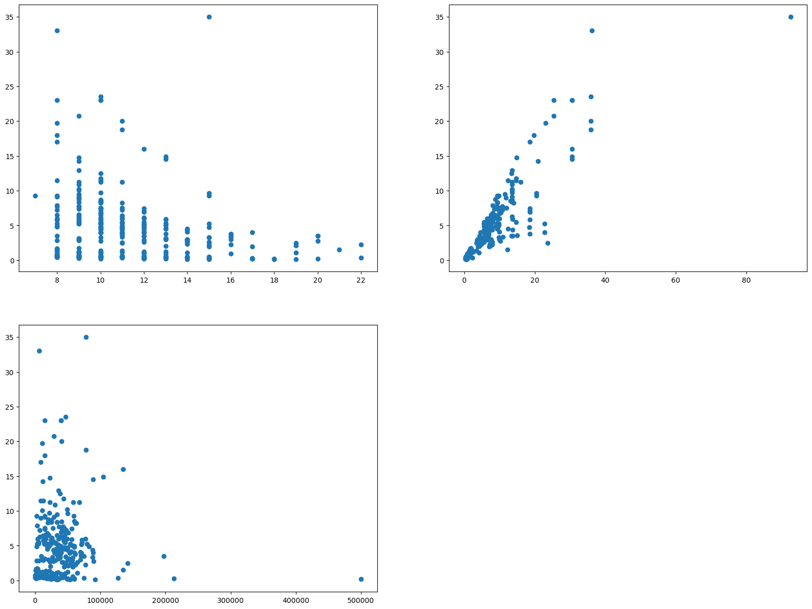
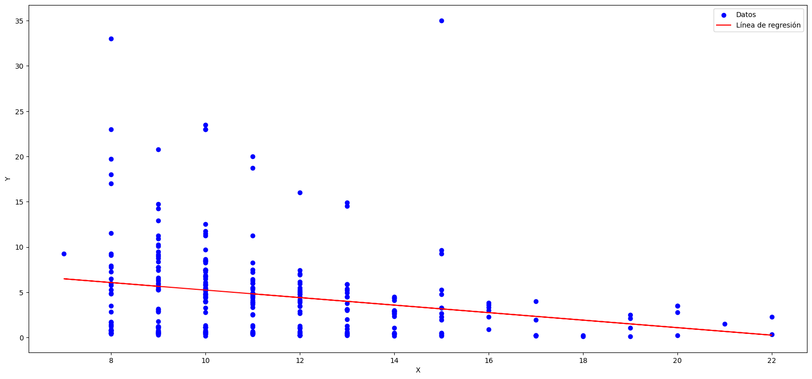
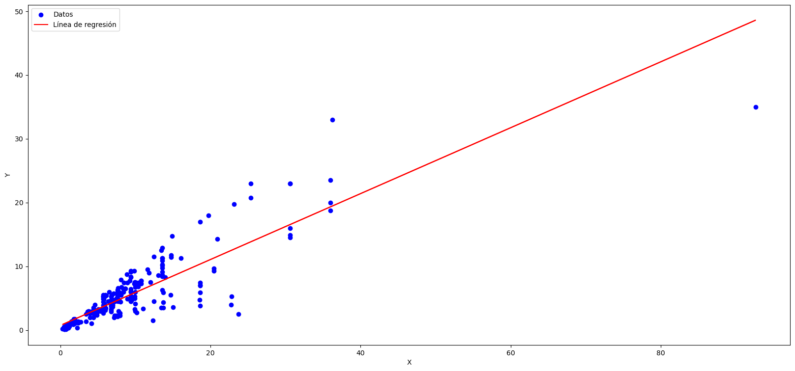

```python
import pandas as pd
import numpy as np
import matplotlib.pyplot as plt
import matplotlib as mpl
import seaborn as sns
```


```python
from sklearn import metrics
import sklearn
from sklearn.model_selection import KFold
from sklearn.model_selection import cross_val_score
from sklearn.model_selection import train_test_split
from sklearn.linear_model import LinearRegression
from sklearn.preprocessing import MinMaxScaler
from sklearn.preprocessing import PolynomialFeatures,StandardScaler
from statsmodels.stats.outliers_influence import variance_inflation_factor 
```


```python
## leemos los datos
df=pd.read_csv('data.csv');
df
```


<div>
<style scoped>
    .dataframe tbody tr th:only-of-type {
        vertical-align: middle;
    }

    .dataframe tbody tr th {
        vertical-align: top;
    }

    .dataframe thead th {
        text-align: right;
    }
</style>
<table border="1" class="dataframe">
  <thead>
    <tr style="text-align: right;">
      <th></th>
      <th>Car_Name</th>
      <th>Year</th>
      <th>Selling_Price</th>
      <th>Present_Price</th>
      <th>Kms_Driven</th>
      <th>Fuel_Type</th>
      <th>Seller_Type</th>
      <th>Transmission</th>
      <th>Owner</th>
    </tr>
  </thead>
  <tbody>
    <tr>
      <th>0</th>
      <td>ritz</td>
      <td>2014</td>
      <td>3.35</td>
      <td>5.59</td>
      <td>27000</td>
      <td>Petrol</td>
      <td>Dealer</td>
      <td>Manual</td>
      <td>0</td>
    </tr>
    <tr>
      <th>1</th>
      <td>sx4</td>
      <td>2013</td>
      <td>4.75</td>
      <td>9.54</td>
      <td>43000</td>
      <td>Diesel</td>
      <td>Dealer</td>
      <td>Manual</td>
      <td>0</td>
    </tr>
    <tr>
      <th>2</th>
      <td>ciaz</td>
      <td>2017</td>
      <td>7.25</td>
      <td>9.85</td>
      <td>6900</td>
      <td>Petrol</td>
      <td>Dealer</td>
      <td>Manual</td>
      <td>0</td>
    </tr>
    <tr>
      <th>3</th>
      <td>wagon r</td>
      <td>2011</td>
      <td>2.85</td>
      <td>4.15</td>
      <td>5200</td>
      <td>Petrol</td>
      <td>Dealer</td>
      <td>Manual</td>
      <td>0</td>
    </tr>
    <tr>
      <th>4</th>
      <td>swift</td>
      <td>2014</td>
      <td>4.60</td>
      <td>6.87</td>
      <td>42450</td>
      <td>Diesel</td>
      <td>Dealer</td>
      <td>Manual</td>
      <td>0</td>
    </tr>
    <tr>
      <th>...</th>
      <td>...</td>
      <td>...</td>
      <td>...</td>
      <td>...</td>
      <td>...</td>
      <td>...</td>
      <td>...</td>
      <td>...</td>
      <td>...</td>
    </tr>
    <tr>
      <th>296</th>
      <td>city</td>
      <td>2016</td>
      <td>9.50</td>
      <td>11.60</td>
      <td>33988</td>
      <td>Diesel</td>
      <td>Dealer</td>
      <td>Manual</td>
      <td>0</td>
    </tr>
    <tr>
      <th>297</th>
      <td>brio</td>
      <td>2015</td>
      <td>4.00</td>
      <td>5.90</td>
      <td>60000</td>
      <td>Petrol</td>
      <td>Dealer</td>
      <td>Manual</td>
      <td>0</td>
    </tr>
    <tr>
      <th>298</th>
      <td>city</td>
      <td>2009</td>
      <td>3.35</td>
      <td>11.00</td>
      <td>87934</td>
      <td>Petrol</td>
      <td>Dealer</td>
      <td>Manual</td>
      <td>0</td>
    </tr>
    <tr>
      <th>299</th>
      <td>city</td>
      <td>2017</td>
      <td>11.50</td>
      <td>12.50</td>
      <td>9000</td>
      <td>Diesel</td>
      <td>Dealer</td>
      <td>Manual</td>
      <td>0</td>
    </tr>
    <tr>
      <th>300</th>
      <td>brio</td>
      <td>2016</td>
      <td>5.30</td>
      <td>5.90</td>
      <td>5464</td>
      <td>Petrol</td>
      <td>Dealer</td>
      <td>Manual</td>
      <td>0</td>
    </tr>
  </tbody>
</table>
<p>301 rows × 9 columns</p>
</div>


```python
df.shape
```


    (301, 9)


```python
df.info()
```

    <class 'pandas.core.frame.DataFrame'>
    RangeIndex: 301 entries, 0 to 300
    Data columns (total 9 columns):
     #   Column         Non-Null Count  Dtype  
    ---  ------         --------------  -----  
     0   Car_Name       301 non-null    object 
     1   Year           301 non-null    int64  
     2   Selling_Price  301 non-null    float64
     3   Present_Price  301 non-null    float64
     4   Kms_Driven     301 non-null    int64  
     5   Fuel_Type      301 non-null    object 
     6   Seller_Type    301 non-null    object 
     7   Transmission   301 non-null    object 
     8   Owner          301 non-null    int64  
    dtypes: float64(2), int64(3), object(4)
    memory usage: 21.3+ KB


```python
df.describe(include='all')
```


<div>
<style scoped>
    .dataframe tbody tr th:only-of-type {
        vertical-align: middle;
    }

    .dataframe tbody tr th {
        vertical-align: top;
    }

    .dataframe thead th {
        text-align: right;
    }
</style>
<table border="1" class="dataframe">
  <thead>
    <tr style="text-align: right;">
      <th></th>
      <th>Car_Name</th>
      <th>Year</th>
      <th>Selling_Price</th>
      <th>Present_Price</th>
      <th>Kms_Driven</th>
      <th>Fuel_Type</th>
      <th>Seller_Type</th>
      <th>Transmission</th>
      <th>Owner</th>
    </tr>
  </thead>
  <tbody>
    <tr>
      <th>count</th>
      <td>301</td>
      <td>301.000000</td>
      <td>301.000000</td>
      <td>301.000000</td>
      <td>301.000000</td>
      <td>301</td>
      <td>301</td>
      <td>301</td>
      <td>301.000000</td>
    </tr>
    <tr>
      <th>unique</th>
      <td>98</td>
      <td>NaN</td>
      <td>NaN</td>
      <td>NaN</td>
      <td>NaN</td>
      <td>3</td>
      <td>2</td>
      <td>2</td>
      <td>NaN</td>
    </tr>
    <tr>
      <th>top</th>
      <td>city</td>
      <td>NaN</td>
      <td>NaN</td>
      <td>NaN</td>
      <td>NaN</td>
      <td>Petrol</td>
      <td>Dealer</td>
      <td>Manual</td>
      <td>NaN</td>
    </tr>
    <tr>
      <th>freq</th>
      <td>26</td>
      <td>NaN</td>
      <td>NaN</td>
      <td>NaN</td>
      <td>NaN</td>
      <td>239</td>
      <td>195</td>
      <td>261</td>
      <td>NaN</td>
    </tr>
    <tr>
      <th>mean</th>
      <td>NaN</td>
      <td>2013.627907</td>
      <td>4.661296</td>
      <td>7.628472</td>
      <td>36947.205980</td>
      <td>NaN</td>
      <td>NaN</td>
      <td>NaN</td>
      <td>0.043189</td>
    </tr>
    <tr>
      <th>std</th>
      <td>NaN</td>
      <td>2.891554</td>
      <td>5.082812</td>
      <td>8.644115</td>
      <td>38886.883882</td>
      <td>NaN</td>
      <td>NaN</td>
      <td>NaN</td>
      <td>0.247915</td>
    </tr>
    <tr>
      <th>min</th>
      <td>NaN</td>
      <td>2003.000000</td>
      <td>0.100000</td>
      <td>0.320000</td>
      <td>500.000000</td>
      <td>NaN</td>
      <td>NaN</td>
      <td>NaN</td>
      <td>0.000000</td>
    </tr>
    <tr>
      <th>25%</th>
      <td>NaN</td>
      <td>2012.000000</td>
      <td>0.900000</td>
      <td>1.200000</td>
      <td>15000.000000</td>
      <td>NaN</td>
      <td>NaN</td>
      <td>NaN</td>
      <td>0.000000</td>
    </tr>
    <tr>
      <th>50%</th>
      <td>NaN</td>
      <td>2014.000000</td>
      <td>3.600000</td>
      <td>6.400000</td>
      <td>32000.000000</td>
      <td>NaN</td>
      <td>NaN</td>
      <td>NaN</td>
      <td>0.000000</td>
    </tr>
    <tr>
      <th>75%</th>
      <td>NaN</td>
      <td>2016.000000</td>
      <td>6.000000</td>
      <td>9.900000</td>
      <td>48767.000000</td>
      <td>NaN</td>
      <td>NaN</td>
      <td>NaN</td>
      <td>0.000000</td>
    </tr>
    <tr>
      <th>max</th>
      <td>NaN</td>
      <td>2018.000000</td>
      <td>35.000000</td>
      <td>92.600000</td>
      <td>500000.000000</td>
      <td>NaN</td>
      <td>NaN</td>
      <td>NaN</td>
      <td>3.000000</td>
    </tr>
  </tbody>
</table>
</div>


```python
# Removemos la columna Car_Name
df.drop(columns='Car_Name',inplace=True)
```


```python
df
```


<div>
<style scoped>
    .dataframe tbody tr th:only-of-type {
        vertical-align: middle;
    }

    .dataframe tbody tr th {
        vertical-align: top;
    }

    .dataframe thead th {
        text-align: right;
    }
</style>
<table border="1" class="dataframe">
  <thead>
    <tr style="text-align: right;">
      <th></th>
      <th>Year</th>
      <th>Selling_Price</th>
      <th>Present_Price</th>
      <th>Kms_Driven</th>
      <th>Fuel_Type</th>
      <th>Seller_Type</th>
      <th>Transmission</th>
      <th>Owner</th>
    </tr>
  </thead>
  <tbody>
    <tr>
      <th>0</th>
      <td>2014</td>
      <td>3.35</td>
      <td>5.59</td>
      <td>27000</td>
      <td>Petrol</td>
      <td>Dealer</td>
      <td>Manual</td>
      <td>0</td>
    </tr>
    <tr>
      <th>1</th>
      <td>2013</td>
      <td>4.75</td>
      <td>9.54</td>
      <td>43000</td>
      <td>Diesel</td>
      <td>Dealer</td>
      <td>Manual</td>
      <td>0</td>
    </tr>
    <tr>
      <th>2</th>
      <td>2017</td>
      <td>7.25</td>
      <td>9.85</td>
      <td>6900</td>
      <td>Petrol</td>
      <td>Dealer</td>
      <td>Manual</td>
      <td>0</td>
    </tr>
    <tr>
      <th>3</th>
      <td>2011</td>
      <td>2.85</td>
      <td>4.15</td>
      <td>5200</td>
      <td>Petrol</td>
      <td>Dealer</td>
      <td>Manual</td>
      <td>0</td>
    </tr>
    <tr>
      <th>4</th>
      <td>2014</td>
      <td>4.60</td>
      <td>6.87</td>
      <td>42450</td>
      <td>Diesel</td>
      <td>Dealer</td>
      <td>Manual</td>
      <td>0</td>
    </tr>
    <tr>
      <th>...</th>
      <td>...</td>
      <td>...</td>
      <td>...</td>
      <td>...</td>
      <td>...</td>
      <td>...</td>
      <td>...</td>
      <td>...</td>
    </tr>
    <tr>
      <th>296</th>
      <td>2016</td>
      <td>9.50</td>
      <td>11.60</td>
      <td>33988</td>
      <td>Diesel</td>
      <td>Dealer</td>
      <td>Manual</td>
      <td>0</td>
    </tr>
    <tr>
      <th>297</th>
      <td>2015</td>
      <td>4.00</td>
      <td>5.90</td>
      <td>60000</td>
      <td>Petrol</td>
      <td>Dealer</td>
      <td>Manual</td>
      <td>0</td>
    </tr>
    <tr>
      <th>298</th>
      <td>2009</td>
      <td>3.35</td>
      <td>11.00</td>
      <td>87934</td>
      <td>Petrol</td>
      <td>Dealer</td>
      <td>Manual</td>
      <td>0</td>
    </tr>
    <tr>
      <th>299</th>
      <td>2017</td>
      <td>11.50</td>
      <td>12.50</td>
      <td>9000</td>
      <td>Diesel</td>
      <td>Dealer</td>
      <td>Manual</td>
      <td>0</td>
    </tr>
    <tr>
      <th>300</th>
      <td>2016</td>
      <td>5.30</td>
      <td>5.90</td>
      <td>5464</td>
      <td>Petrol</td>
      <td>Dealer</td>
      <td>Manual</td>
      <td>0</td>
    </tr>
  </tbody>
</table>
<p>301 rows × 8 columns</p>
</div>


```python
maximum=2024
Age=df['Year'].apply(lambda x:(maximum+1)-x)
df.drop('Year',axis=1,inplace=True)
df.insert(0,'Age',Age);df
```


<div>
<style scoped>
    .dataframe tbody tr th:only-of-type {
        vertical-align: middle;
    }

    .dataframe tbody tr th {
        vertical-align: top;
    }

    .dataframe thead th {
        text-align: right;
    }
</style>
<table border="1" class="dataframe">
  <thead>
    <tr style="text-align: right;">
      <th></th>
      <th>Age</th>
      <th>Selling_Price</th>
      <th>Present_Price</th>
      <th>Kms_Driven</th>
      <th>Fuel_Type</th>
      <th>Seller_Type</th>
      <th>Transmission</th>
      <th>Owner</th>
    </tr>
  </thead>
  <tbody>
    <tr>
      <th>0</th>
      <td>11</td>
      <td>3.35</td>
      <td>5.59</td>
      <td>27000</td>
      <td>Petrol</td>
      <td>Dealer</td>
      <td>Manual</td>
      <td>0</td>
    </tr>
    <tr>
      <th>1</th>
      <td>12</td>
      <td>4.75</td>
      <td>9.54</td>
      <td>43000</td>
      <td>Diesel</td>
      <td>Dealer</td>
      <td>Manual</td>
      <td>0</td>
    </tr>
    <tr>
      <th>2</th>
      <td>8</td>
      <td>7.25</td>
      <td>9.85</td>
      <td>6900</td>
      <td>Petrol</td>
      <td>Dealer</td>
      <td>Manual</td>
      <td>0</td>
    </tr>
    <tr>
      <th>3</th>
      <td>14</td>
      <td>2.85</td>
      <td>4.15</td>
      <td>5200</td>
      <td>Petrol</td>
      <td>Dealer</td>
      <td>Manual</td>
      <td>0</td>
    </tr>
    <tr>
      <th>4</th>
      <td>11</td>
      <td>4.60</td>
      <td>6.87</td>
      <td>42450</td>
      <td>Diesel</td>
      <td>Dealer</td>
      <td>Manual</td>
      <td>0</td>
    </tr>
    <tr>
      <th>...</th>
      <td>...</td>
      <td>...</td>
      <td>...</td>
      <td>...</td>
      <td>...</td>
      <td>...</td>
      <td>...</td>
      <td>...</td>
    </tr>
    <tr>
      <th>296</th>
      <td>9</td>
      <td>9.50</td>
      <td>11.60</td>
      <td>33988</td>
      <td>Diesel</td>
      <td>Dealer</td>
      <td>Manual</td>
      <td>0</td>
    </tr>
    <tr>
      <th>297</th>
      <td>10</td>
      <td>4.00</td>
      <td>5.90</td>
      <td>60000</td>
      <td>Petrol</td>
      <td>Dealer</td>
      <td>Manual</td>
      <td>0</td>
    </tr>
    <tr>
      <th>298</th>
      <td>16</td>
      <td>3.35</td>
      <td>11.00</td>
      <td>87934</td>
      <td>Petrol</td>
      <td>Dealer</td>
      <td>Manual</td>
      <td>0</td>
    </tr>
    <tr>
      <th>299</th>
      <td>8</td>
      <td>11.50</td>
      <td>12.50</td>
      <td>9000</td>
      <td>Diesel</td>
      <td>Dealer</td>
      <td>Manual</td>
      <td>0</td>
    </tr>
    <tr>
      <th>300</th>
      <td>9</td>
      <td>5.30</td>
      <td>5.90</td>
      <td>5464</td>
      <td>Petrol</td>
      <td>Dealer</td>
      <td>Manual</td>
      <td>0</td>
    </tr>
  </tbody>
</table>
<p>301 rows × 8 columns</p>
</div>


```python
fig=plt.figure(figsize=(20,15))
fs=mpl.gridspec.GridSpec(2,2)
ax0=fig.add_subplot(fs[0:1,0:1])
# Diagrama de dispercion año por precio de venta
ax0.scatter(df['Age'],df['Selling_Price'])
ax1=fig.add_subplot(fs[0:1,1:])
# Diagrama de dispercion precio precente por precio de venta
ax1.scatter(df['Present_Price'],df['Selling_Price'])
ax2=fig.add_subplot(fs[1:2,0:1])
# Diagrama de dispercion kilometraje por precio de venta
ax2.scatter(df['Kms_Driven'],df['Selling_Price'])

```


    <matplotlib.collections.PathCollection at 0x17fabcf10>


    

    


```python

X = np.array(df[['Age']])
Y = df['Selling_Price'].values
modelo = LinearRegression()
modelo.fit(X,Y)
# Graficar los datos y la línea de regresión
plt.scatter (X, Y, color='blue', label='Datos')
plt.plot(X, modelo.predict (X), color='red', label='Línea de regresión')
plt.rcParams ['figure.figsize'] = (20,9)
plt.xlabel('X')
plt.ylabel ('Y')
plt.legend()
plt.show()
print(f" La ecuación de la recta es: Y = {modelo.intercept_} + {modelo.coef_[0]}*×")

    
```


    

    


     La ecuación de la recta es: Y = 9.381757045639365 + -0.4150916946355387*×


```python

X = np.array(df[['Present_Price']])
Y = df['Selling_Price'].values
modelo = LinearRegression()
modelo.fit(X,Y)
# Graficar los datos y la línea de regresión
plt.scatter (X, Y, color='blue', label='Datos')
plt.plot(X, modelo.predict (X), color='red', label='Línea de regresión')
plt.rcParams ['figure.figsize'] = (20,9)
plt.xlabel('X')
plt.ylabel ('Y')
plt.legend()
plt.show()
print(f" La ecuación de la recta es: Y = {modelo.intercept_} + {modelo.coef_[0]}*×")

    
```


    

    


     La ecuación de la recta es: Y = 0.7185274709817593 + 0.5168490273953977*×


```python

```
